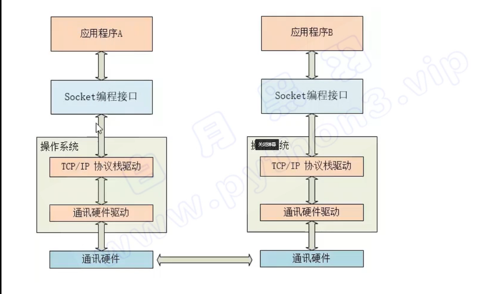

# 1. 名称： 无人机中央任务调度系统

# 2.版本号： 1.0 

# 3. 开发者： 太原工业学院晋速-哪吒队

# 4. 开发工具： 

#  C++,python,qt5 ,Qtdesigner ,socket

# 5. 运行环境：

## 客户端：

vsode   + MinGW

## 服务端： 

ubuntu18.04   ros     

# 6.功能模块：

## 1. 中央任务系统

1. 比赛任务
2. 前进，后退，左转，右转，左移，右移， 起飞， 一键降落，无指令自主悬停
3. 航点规划，输入航点，自主飞行到达航点后悬停，带避障算法
4. 

## 2. 中央监控系统

1. 无人机x,y,z 坐标
2. 无人机cpu 运行占用 内存占用

## 3. 中央通信系统

 使用Socket套接字通信实现上位机与ROS机器人操作系统之间的各类消息通信 

## 4. 中央导航系统

1. 无人机x y z 坐标
2. 雷达点云图
3. 航点图
4. 发布航点，控制无人机
5. 发布起飞指令，控制无人机起飞
6. 

## 5. 中央视觉系统 

1. 摄像头图像
2. opencv 处理后的图像
3. 深感图像
4. 放完物块后的拍照 ，在靶区，w区，房子区，放下物块后，起飞后，拍照，拍下物块的俯视图，三个相框，三张图片
5. 在ros节点里或者用OpenCV调用摄像头，将视频编码后socket网络编程UDP协议实时发送给服务器端，再解码出来交给视频处理算法。最开始用的tcp协议发现有花屏现象，判断为tcp的粘包，所以改用了UDP协议实时传输视频 

# 7. 实现功能

# 8. 使用方法

# 9. 常用问题

# 10. 代码框架

# 11. 语言学习

## 1. C++

## 2.qt5
